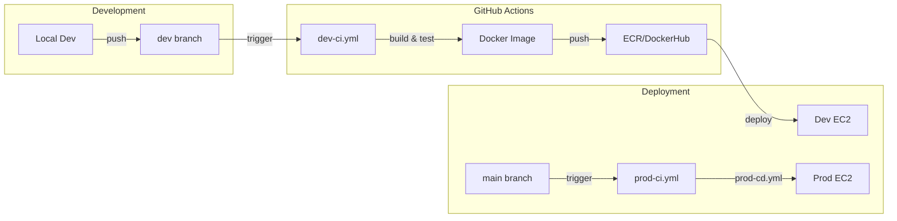
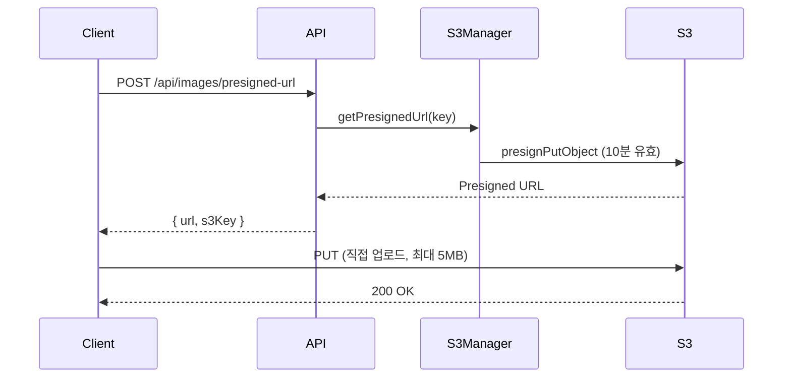

# WePick Backend

> 매일 새로운 A/B 투표와 커뮤니티 기능을 제공하는 백엔드 API 서비스


---

## 목차

1. [Project Introduction](#1-project-introduction)
2. [Infrastructure Architecture](#2-infrastructure-architecture)
3. [Backend Internal Logic](#3-backend-internal-logic)
4. [Key Technical Challenges](#4-key-technical-challenges)
5. [Getting Started](#5-getting-started)
6. [Documentation](#6-documentation)

---

## 1. Project Introduction

### What is WePick?

**WePick**은 매일 하나의 양자택일(A/B) 투표 주제를 제공하고, 사용자들이 커뮤니티에서 의견을 나눌 수 있는 플랫폼입니다.

### Core Values

| Value | Description |
|-------|-------------|
| **Daily Engagement** | 매일 자정 갱신되는 토픽으로 지속적인 사용자 참여 유도 |
| **Real-time Statistics** | 투표 즉시 반영되는 실시간 통계 제공 |
| **Community Interaction** | 게시글, 댓글, 좋아요를 통한 사용자 간 상호작용 |

### Key Features

```
[Topic]     오늘의 투표 조회 → 투표하기 → 실시간 통계 확인 → 아카이브
[Post]      게시글 CRUD → 댓글 → 좋아요 → 커서 기반 페이지네이션
[Auth]      회원가입 → 로그인(세션) → 프로필 관리 → 회원 탈퇴(Soft Delete)
[Image]     Presigned URL 발급 → S3 직접 업로드 → CDN 배포
```

---

## 2. Infrastructure Architecture

### System Overview

***(작성 예정)***

### Infrastructure Components

| Component | Technology | Purpose |
|-----------|------------|---------|
| **Compute** | EC2 (Docker) | Spring Boot 애플리케이션 호스팅 |
| **Database** | RDS MySQL | 영속성 데이터 저장, 세션 저장(JDBC) |
| **Storage** | S3 | 이미지 파일 저장 (Presigned URL) |
| **Secrets** | Parameter Store | DB 자격 증명, API 키 관리 |
| **Load Balancer** | ALB | HTTPS 종단, 트래픽 분산 |
| **Monitoring** | Actuator + Prometheus | 메트릭 수집 및 헬스 체크 |

### CI/CD Pipeline



| Branch | Workflow                      | Target |
|--------|-------------------------------|--------|
| `dev` | `dev-ci.yml` -> `dev-cd.yml`   | Development 환경 자동 배포 |
| `main` | `prod-ci.yml` → `prod-cd.yml` | Production 환경 자동 배포 |

> **상세 내용**: ***(작성 예정)***

---

## 3. Backend Internal Logic

### Architecture Style: Modular Monolith

단일 배포 단위이지만, **도메인별 패키지 분리**를 통해 MSA 전환에 대비한 모듈화를 적용했습니다.

```
src/main/java/gguip1/community/
│
├── global/                    # Cross-cutting Concerns
│   ├── filter/               # SessionAuthFilter (인증 필터)
│   ├── interceptor/          # AuthInterceptor (@Auth 검사)
│   ├── context/              # SecurityContext (ThreadLocal)
│   ├── exception/            # GlobalExceptionHandler, ErrorCode
│   ├── infra/                # S3Manager
│   └── config/               # CORS, JPA, AWS Config
│
└── domain/                    # Business Domains (DDD)
    ├── auth/                 # 인증 (로그인/로그아웃)
    ├── user/                 # 사용자 관리
    ├── post/                 # 게시글, 댓글, 좋아요
    ├── topic/                # 양자택일 투표
    └── image/                # 이미지 관리
```

### Design Philosophy

#### 1. Custom Authentication over Spring Security

Spring Security의 표준 필터 체인 대신, **경량화된 커스텀 인증 시스템**을 구현했습니다.

```
Request → SessionAuthFilter → SecurityContext(ThreadLocal) → AuthInterceptor → @Auth Controller
```

**Why?**
- 학습 목적: Spring Security 내부 동작 원리 이해
- 경량화: 필요한 기능만 구현하여 오버헤드 최소화
- 유연성: 비즈니스 요구사항에 맞춘 커스터마이징 용이

#### 2. Domain-Driven Package Structure

각 도메인은 독립적인 계층 구조를 가지며, 도메인 간 의존성을 최소화합니다.

```
domain/{name}/
├── controller/    # API 엔드포인트 (입력 검증, 응답 변환)
├── service/       # 비즈니스 로직 (트랜잭션 경계)
├── repository/    # 데이터 접근 (JPA, QueryDSL)
├── entity/        # 도메인 모델 (JPA 엔티티)
├── dto/           # 계층 간 데이터 전송 객체
└── mapper/        # Entity ↔ DTO 변환
```

#### 3. Optimistic Concurrency for Voting

투표 기능의 동시성 제어를 위해 DB 레벨 원자적 UPDATE를 사용합니다.

```sql
-- TopicOptionRepository
UPDATE topic_options SET vote_count = vote_count + 1 WHERE option_id = ?
```

> **상세 내용**: ***(작성 예정)***

---

## 4. Key Technical Challenges

### Challenge 1: Docker Image Optimization

**Problem**: 기본 Dockerfile로 빌드 시 이미지 크기 **900MB+**

**Solution**: Multi-stage build + jlink를 통한 커스텀 JRE 생성

| Stage | Image Size | Reduction |
|-------|------------|-----------|
| Single Stage (gradle:8.5-jdk21) | ~900MB | - |
| Multi Stage (eclipse-temurin:21-jre-alpine) | ~350MB | -61% |
| **jlink Custom JRE (alpine:latest)** | **~150MB** | **-83%** |

> **상세 내용**: [docs/problems/docker/README.md](./docs/problems/docker/README.md)

---

### Challenge 2: Session Management at Scale

**Problem**: 기본 인메모리 세션은 서버 재시작 시 세션 유실

**Solution**: `spring-session-jdbc`를 통한 DB 기반 세션 저장

```yaml
# application.yml
spring:
  session:
    store-type: jdbc
    jdbc:
      initialize-schema: always
```

**Benefits**:
- 서버 재시작/배포 시에도 세션 유지
- 다중 인스턴스 환경에서 세션 공유 가능
- HikariCP 커넥션 풀을 통한 효율적인 DB 연결 관리

---

### Challenge 3: Presigned URL for Scalable Image Upload

**Problem**: 서버를 통한 이미지 업로드 시 대역폭 및 메모리 부담

**Solution**: S3 Presigned URL을 통한 클라이언트 직접 업로드



**Benefits**:
- 서버 부하 감소 (대용량 파일이 서버를 거치지 않음)
- 업로드 속도 향상 (클라이언트 → S3 직접 연결)
- 보안 유지 (임시 URL, 10분 만료)

---

[//]: # (## 5. Getting Started)

[//]: # ()
[//]: # (### Prerequisites)

[//]: # ()
[//]: # (- Java 21)

[//]: # (- Gradle 8.x)

[//]: # (- MySQL 8.x)

[//]: # (- Docker &#40;선택&#41;)

[//]: # (- AWS 계정 &#40;S3, Parameter Store&#41;)

[//]: # ()
[//]: # (### Quick Start &#40;Docker&#41;)

[//]: # ()
[//]: # (```bash)

[//]: # (# 개발 환경)

[//]: # (docker-compose -f docker/dev/docker-compose.yml up -d)

[//]: # ()
[//]: # (# 프로덕션 환경)

[//]: # (docker-compose -f docker/prod/docker-compose.yml up -d)

[//]: # (```)

[//]: # ()
[//]: # (### Local Development)

[//]: # ()
[//]: # (```bash)

[//]: # (# 1. Clone)

[//]: # (git clone https://github.com/100-hours-a-week/3-ellim-lee-community-be.git)

[//]: # (cd 3-ellim-lee-community-be)

[//]: # ()
[//]: # (# 2. Configure)

[//]: # (cp src/main/resources/application-dev.yml src/main/resources/application-local.yml)

[//]: # (# Edit application-local.yml with your DB & AWS credentials)

[//]: # ()
[//]: # (# 3. Build & Run)

[//]: # (./gradlew clean build)

[//]: # (./gradlew bootRun --args='--spring.profiles.active=local')

[//]: # (```)

[//]: # ()
[//]: # (### API Documentation)

[//]: # ()
[//]: # (애플리케이션 실행 후 Swagger UI 접속:)

[//]: # (```)

[//]: # (http://localhost:8080/api/swagger-ui.html)

[//]: # (```)

[//]: # ()
[//]: # (---)

## 5. Documentation

### Project Documents

| Document | Description | Link |
|----------|-------------|------|
| Backend Architecture | 시스템 구조, 데이터 흐름, 컴포넌트 설명 | [docs/architecture/BACKEND_ARCHITECTURE.md](./docs/architecture/BACKEND_ARCHITECTURE.md) |
| Topic API Spec | 양자택일 투표 API 명세 | [docs/api/topic_api.md](./docs/api/topic_api.md) |
| Docker Optimization | 이미지 최적화 과정 | [docs/problems/docker/README.md](./docs/problems/docker/README.md) |
| Coding Conventions | 코딩 규칙 및 패턴 | [docs/gemini/2_CODING_CONVENTIONS.md](./docs/gemini/2_CODING_CONVENTIONS.md) |

### External Resources

| Resource | Link |
|----------|------|
| API 명세서 (Google Sheets) | [Link](https://docs.google.com/spreadsheets/d/14p7ppmWjfA4FWeHc4dvRo8pL8MjHQtqkd7Q5522O754/edit?gid=1878554884#gid=1878554884) |
| ERD 다이어그램 | [ERDCloud](https://www.erdcloud.com/d/w4FDHBTdYa74Jp4vn) |
| Frontend Repository | [3-ellim-lee-community-fe](https://github.com/100-hours-a-week/3-ellim-lee-community-fe) |

---

## Tech Stack

| Category | Technology | Version |
|----------|------------|---------|
| Language | Java | 21 (LTS) |
| Framework | Spring Boot | 3.5.6 |
| ORM | Spring Data JPA | - |
| Database | MySQL | 8.x |
| Session | spring-session-jdbc | - |
| Cloud | AWS S3, Parameter Store | - |
| Monitoring | Actuator, Prometheus | - |
| API Docs | springdoc-openapi | 2.8.14 |
| Build | Gradle | 8.x |
| Container | Docker | - |
| CI/CD | GitHub Actions | - |

---

## Branch Strategy

| Branch | Purpose |
|--------|---------|
| `main` | Production 릴리스 |
| `dev` | Development 통합 |
| `feature/*` | 기능 개발 |
| `docs/*` | 문서 작업 |