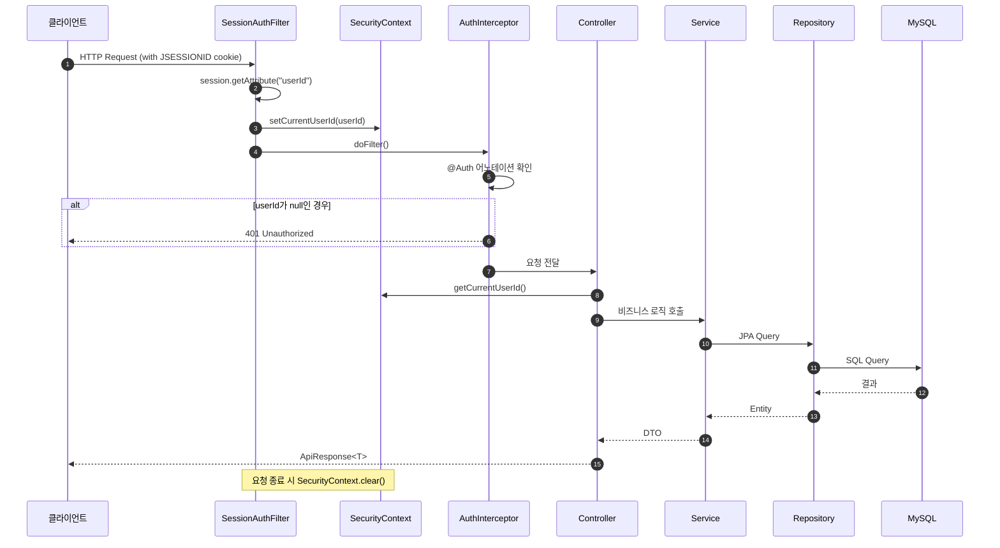
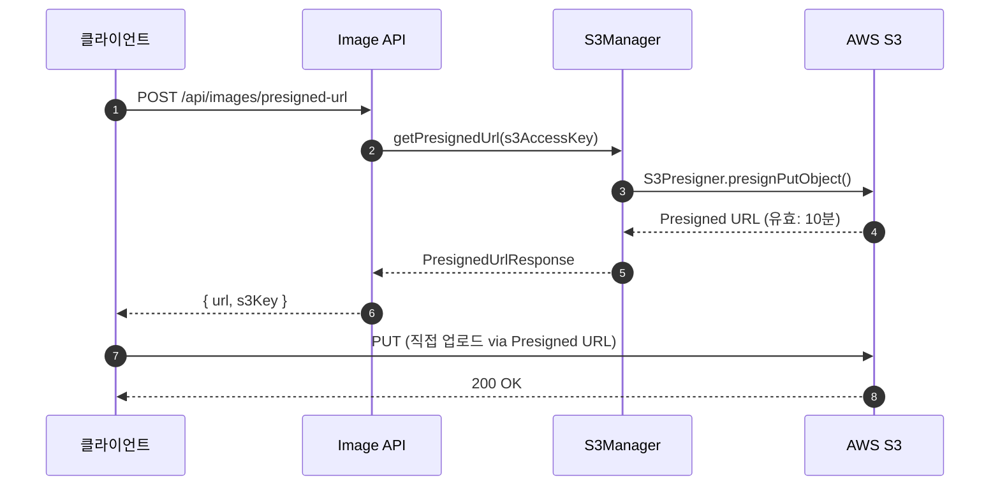
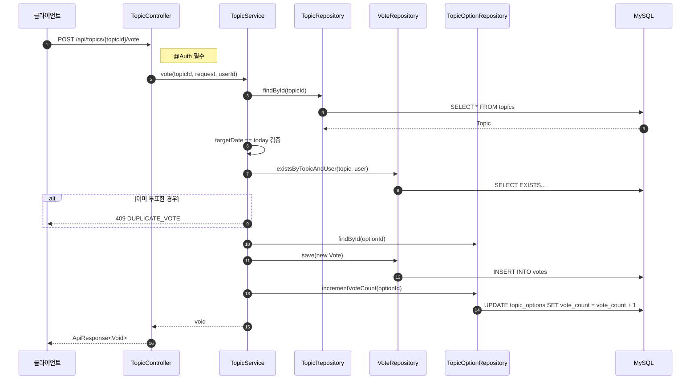
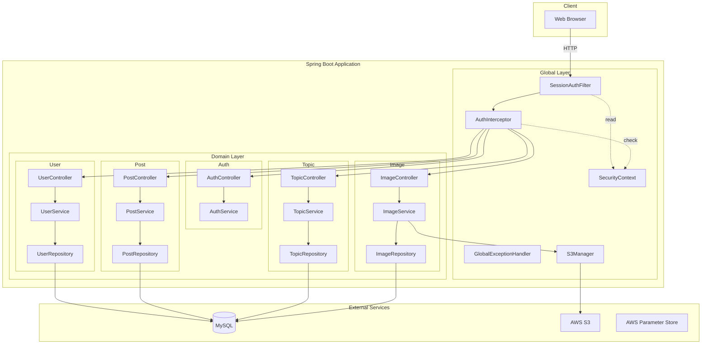

# 백엔드 시스템 아키텍처 분석

> 작성일: 2025-12-08
> 분석 대상: `3-ellim-lee-community-be` 프로젝트

---

## 1. 시스템 아키텍처 요약

### 아키텍처 스타일: Modular Monolith (모듈형 모놀리식)

이 프로젝트는 **단일 배포 단위(Monolithic)**이지만, 내부적으로 **도메인별 패키지 분리**를 통해 모듈화되어 있습니다.

```
src/main/java/gguip1/community/
├── global/          # 공통 인프라 (인증, 예외처리, 설정, S3 등)
│   ├── filter/      # SessionAuthFilter
│   ├── interceptor/ # AuthInterceptor
│   ├── context/     # SecurityContext (ThreadLocal)
│   ├── exception/   # GlobalExceptionHandler, ErrorCode
│   ├── infra/       # S3Manager
│   └── config/      # CORS, JPA, AWS, Security Config
│
└── domain/          # 비즈니스 도메인 (DDD 스타일)
    ├── user/        # 사용자 관리
    ├── auth/        # 인증 (로그인/로그아웃)
    ├── post/        # 게시글, 댓글, 좋아요
    ├── topic/       # 양자택일 투표
    └── image/       # 이미지 관리
```

### 계층 구조 (각 도메인 내부)

```
domain/{도메인명}/
├── controller/    # REST API 엔드포인트
├── service/       # 비즈니스 로직
├── repository/    # 데이터 접근 (JPA)
├── entity/        # JPA 엔티티
├── dto/           # Request/Response DTO
└── mapper/        # Entity ↔ DTO 변환
```

---

## 2. 데이터 흐름도 (Mermaid 시퀀스 다이어그램)

### 2.1 인증이 필요한 API 요청 흐름



### 2.2 이미지 업로드 흐름 (AWS S3 연동)



### 2.3 양자택일 투표 흐름



---

## 3. 핵심 기술 및 인프라

| 구분 | 기술 | 버전 | 비고 |
|------|------|------|------|
| **Language** | Java | 21 | LTS |
| **Framework** | Spring Boot | 3.5.6 | |
| **ORM** | Spring Data JPA | - | Hibernate 기반 |
| **Database** | MySQL | - | `spring-session-jdbc`로 세션 저장 |
| **Cloud** | AWS S3 | - | 이미지 저장소 (Presigned URL 방식) |
| **Cloud** | AWS Parameter Store | - | 설정 값 관리 |
| **API Docs** | SpringDoc OpenAPI | 2.8.14 | Swagger UI |
| **Monitoring** | Actuator + Prometheus | - | 메트릭 수집 |
| **Security** | Spring Security Crypto | 6.4.5 | 비밀번호 암호화만 사용 |
| **Template** | Thymeleaf | - | 서버 사이드 렌더링 (제한적) |
| **Build** | Gradle | - | |

### 인증 시스템 (커스텀)

Spring Security의 표준 필터 체인을 사용하지 않고, 독자적인 세션 기반 인증 구현:

1. **`SessionAuthFilter`**: HTTP 세션에서 `userId` 추출 → `SecurityContext`(ThreadLocal)에 저장
2. **`@Auth` 어노테이션**: 인증이 필요한 컨트롤러 메서드에 선언
3. **`AuthInterceptor`**: `@Auth`가 붙은 메서드 호출 전 `SecurityContext.getCurrentUserId()` 검사

### 배포 환경

- **컨테이너화**: Docker (multi-stage build, jlink 최적화)
- **세션 저장**: JDBC 기반 (`spring-session-jdbc`)
- **커넥션 풀**: HikariCP

---

## 4. 주요 기능 명세 (핵심 비즈니스 로직)

### 4.1 게시글 관리 (Post)

**위치**: `domain/post/service/PostService.java`

| 기능 | API | 설명 |
|------|-----|------|
| 게시글 작성 | `POST /api/posts` | 제목, 내용, 이미지(선택) 포함 |
| 게시글 목록 | `GET /api/posts` | 커서 기반 페이지네이션 |
| 게시글 상세 | `GET /api/posts/{id}` | 조회수 증가, 좋아요 여부 반환 |
| 게시글 수정 | `PUT /api/posts/{id}` | 작성자만 가능 |
| 게시글 삭제 | `DELETE /api/posts/{id}` | Soft Delete |

**핵심 로직**:
- 이미지는 `PostImage` 중간 테이블로 다대다 관계 관리
- `PostStat` 엔티티로 통계(조회수, 좋아요, 댓글 수) 비정규화
- 작성자 검증 (`userId` 비교) 후 수정/삭제 허용

### 4.2 사용자 인증 (Auth)

**위치**: `domain/auth/service/AuthService.java`

| 기능 | API | 설명 |
|------|-----|------|
| 로그인 | `POST /api/auth/login` | 이메일/비밀번호 검증 후 세션 생성 |
| 로그아웃 | `POST /api/auth/logout` | 세션 무효화 |

**핵심 로직**:
- 비밀번호는 `PasswordEncoder`로 암호화 저장/검증
- 로그인 성공 시 세션에 `userId` 저장 → 이후 `SessionAuthFilter`가 추출
- Soft Delete된 사용자의 이메일/닉네임 재사용 허용을 위한 처리

### 4.3 양자택일 투표 (Topic)

**위치**: `domain/topic/service/TopicService.java`

| 기능 | API | 설명 |
|------|-----|------|
| 오늘의 토픽 조회 | `GET /api/topics/today` | 해당 날짜의 토픽 + 투표 통계 반환 |
| 투표하기 | `POST /api/topics/{id}/vote` | 1일 1회 제한, 당일만 투표 가능 |
| 토픽 생성 | `POST /api/topics` | 관리자용, 1일 1토픽 제한 |
| 토픽 수정 | `PATCH /api/topics/{id}` | 관리자용 |
| 아카이브 조회 | `GET /api/topics` | 지난 토픽 페이지네이션 |

**핵심 로직**:
- `targetDate`가 오늘인 토픽만 투표 가능
- `Vote` 테이블에 `(topic_id, user_id)` UNIQUE 제약으로 중복 투표 방지
- `TopicOption.voteCount`를 DB 레벨 원자적 UPDATE로 동시성 제어
  ```java
  topicOptionRepository.incrementVoteCount(option.getOptionId());
  // → UPDATE topic_options SET vote_count = vote_count + 1 WHERE option_id = ?
  ```
- 투표율(percent)은 조회 시점에 계산하여 반환

---

## 5. 주요 파일 참조

| 역할 | 파일 경로 |
|------|----------|
| 인증 필터 | `global/filter/SessionAuthFilter.java` |
| 인증 인터셉터 | `global/interceptor/AuthInterceptor.java` |
| 보안 컨텍스트 | `global/context/SecurityContext.java` |
| 전역 예외 처리 | `global/exception/GlobalExceptionHandler.java` |
| 에러 코드 정의 | `global/exception/ErrorCode.java` |
| S3 연동 | `global/infra/S3Manager.java` |
| 게시글 서비스 | `domain/post/service/PostService.java` |
| 인증 서비스 | `domain/auth/service/AuthService.java` |
| 투표 서비스 | `domain/topic/service/TopicService.java` |

---

## 6. 아키텍처 다이어그램 (컴포넌트 뷰)



---

## 요약

이 백엔드는 **Spring Boot 3 기반의 모듈형 모놀리식 아키텍처**로, 도메인 주도 설계(DDD) 패턴을 적용하여 각 비즈니스 도메인(User, Post, Topic, Image)을 독립적으로 관리합니다. 인증은 Spring Security 대신 커스텀 세션 기반 필터/인터셉터를 사용하며, AWS S3로 이미지를 저장하고 Presigned URL을 통해 클라이언트가 직접 업로드하는 구조입니다.
